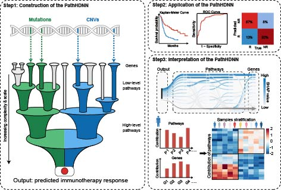

<<<<<<< HEAD
# PathHDNN
=======
<<<<<<< HEAD
# PathHDNN
=======
# PathHDNN - A pathway hierarchical-informed deep neural network framework for predicting immunotherapy response and mechanism interpretation
-----------------------------------------------------------------
Code by **Xiangmei Li** and **Bingyue Pan** at Harbin Medical University.

## 1. Introduction
This repository contains source code and data for **PathHDNN** 

**PathHDNN** is a pathway hierarchical-informed deep neural network (PathHDNN) framework to predict the therapeutic responses of cancer patients and identify key pathways associated with immunotherapy efficacy.

## 2. Design of PathHDNN

Figure 1: Overall architecture of PathHDNN

## 3. Installation

**PathHDNN** relies on [Python (version 3.9)](https://www.python.org/downloads/release/python-390/) environments.

## 4. Usage

We have made available all the code necessary to execute **PathHDNN** in this GitHub repository. Please ensure that you replace the input data paths in the code with your own storage locations.

**1. Code**: The complete code for **PathHDNN** is located at folder ``PathHDNN/``.

**2. Data**: The datasets used to train **PathHDNN** are located at folder ``data/``
| File                              | Description                                                                   |
|------------------------------------|------------------------------------------------------------------------|
| maf_data.txt                             | Alteration features of genes                            |
| pathways.tsv                           | Hierarchical structure of reactome|
| reactome_data.txt                           | Relationships between alteration features and biological entities                             |
| sample_data.txt | Patient lable                                       |

**3. Output**: Get the best trained model. The models used in this paper are located at folder ``data/``,named ``144_train_model/``.

## 5. Interpretation of the PathHDNN model

To further clarify the decision-making process of PathHDNN and identify important genes or pathways influencing immunotherapy response prediction, SHapley Additive exPlannations (**SHAP**) algorithm was employed to interpret the PathHDNN model.

The code for calculating **SHAP value** is in the file ``model_explain.py`` which located at folder ``PathHDNN/``.
